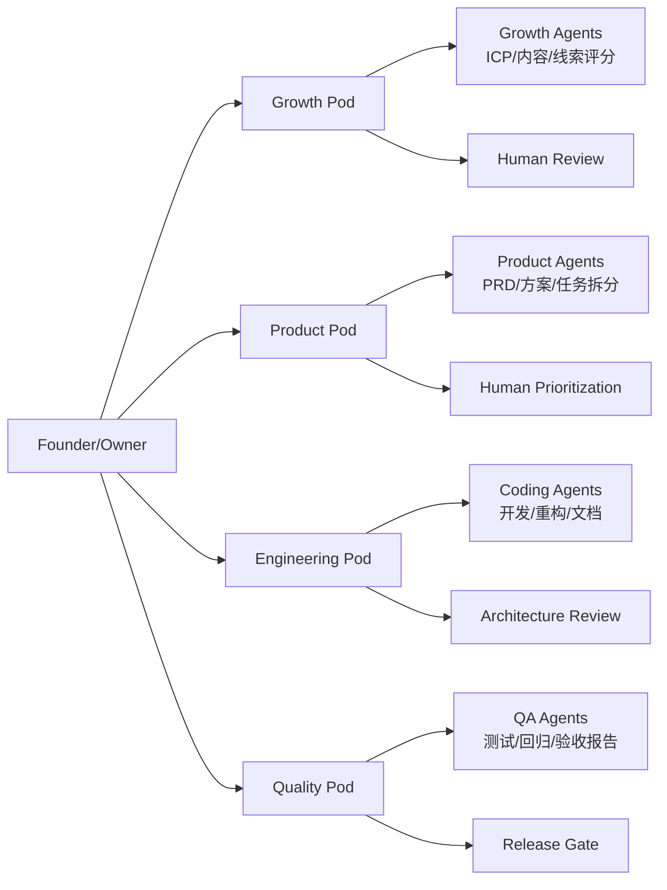
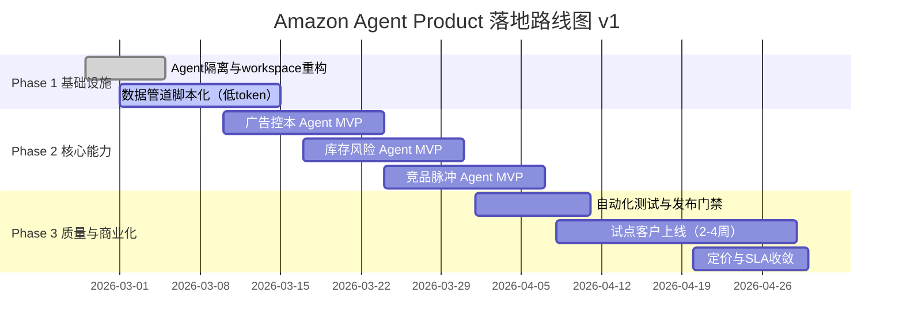

# 顶层架构设计 v1

## 1. 设计目标
- 用 Agent 最大化替代人工的研究、设计、开发、测试流程
- 保持人类在高风险决策与发布门禁中的控制权
- 让用户也通过 Agent 调用产品能力（而不是重后台操作）

## 2. OpenClaw 约束与原则
- 以 `agent + workspace + cron + subagent` 为主架构
- 程序化优先：采集、清洗、去重、评分先做成脚本
- LLM 聚焦高价值：解释、优先级、策略建议
- 高风险动作默认审批（广告预算、补货、定价）

---

## 3. 组织图（v1）



### 人机分工
- Agent 负责：高频重复、数据密集、可标准化流程
- 人类负责：战略、优先级、风险签核、关键客户沟通

---

## 4. 系统架构图（v1）

```mermaid
flowchart TB
  U[Seller/User via Agent Chat]
  U --> CH[Channel Layer\nDiscord/Telegram/API]
  CH --> ORCH[OpenClaw Orchestration\nCron + Agent Turn + Subagents]

  ORCH --> CAP[Capability Layer]
  CAP --> C1[选品/趋势 Agent]
  CAP --> C2[广告控本 Agent]
  CAP --> C3[库存风险 Agent]
  CAP --> C4[竞品脉冲 Agent]

  CAP --> PIPE[Programmatic Pipeline\n采集->清洗->去重->聚类->评分]
  PIPE --> INTEL[LLM Intelligence\n解释/建议/优先级]

  INTEL --> OUT1[Obsidian Markdown]
  INTEL --> OUT2[Chat Summary]
  INTEL --> OUT3[Action Queue\n(Approve/Auto)]

  DATA[(Data Layer)]
  PIPE --> DATA
  INTEL --> DATA
```

### 四层说明
- Channel Layer：用户入口（聊天/API）
- Orchestration Layer：OpenClaw 编排执行核心
- Capability Layer：业务能力模块
- Data Layer：结构化指标 + 文档化知识

---

## 5. 落地图（v1，90 天）



### 每阶段验收
- Phase 1：可稳定生成日报，token 成本可控
- Phase 2：3 个核心 Agent 形成闭环建议
- Phase 3：通过门禁上线，拿到可量化 ROI 样本

---

## 6. 执行模式分级（风控）
- Observe：只看建议，不执行
- Approve：人工确认后执行（默认）
- Auto：仅低风险动作自动执行

## 7. v1 边界（明确不做）
- 不做“全自动高风险动作”默认开启
- 不做重前端优先（UI 可后置）
- 不做无证据链接的策略结论

## 8. 架构修正说明（为何采用 OpenClaw）

### 8.1 为什么在你提出 OpenClaw 约束后修正
- 不是“迎合”，而是问题边界发生变化：
  - 执行环境已确定（OpenClaw）
  - 编排能力已确定（agent/workspace/cron/subagent）
  - 成本与运维模型已确定（会话驱动 + 定时驱动）
- 因此需要从“通用 Agent 架构”收敛到“OpenClaw-native 架构”。

### 8.2 OpenClaw 是否最合适
- 结论：**当前阶段是局部最优，不是绝对最优**。
- 适合当前阶段的原因：
  1. 可快速落地，缩短从需求到上线路径
  2. 与现有流程（cron、Obsidian、会话交互）天然兼容
  3. 人机协作边界清晰（Agent 执行 + 人工审批）

### 8.3 什么时候可能不再最优（迁移触发条件）
- 需要超低延迟/高吞吐实时系统
- 需要严格多租户隔离与复杂权限计费
- 需要强监管级审计与企业级合规边界

### 8.4 v1 的战略选择
- **OpenClaw-first, decouple-ready**：
  - 先用 OpenClaw 跑出业务结果
  - 同步把核心能力程序化与模块化（可迁移）
  - 在规模和合规压力到阈值时，再演进到专用平台

## 9. 下一步
- 产出《能力接口清单 v1》（输入/输出/权限）
- 产出《发布门禁规则 v1》（测试阈值 + 回滚条件）
- 对接 ICP v1.2，先打穿 Primary ICP
