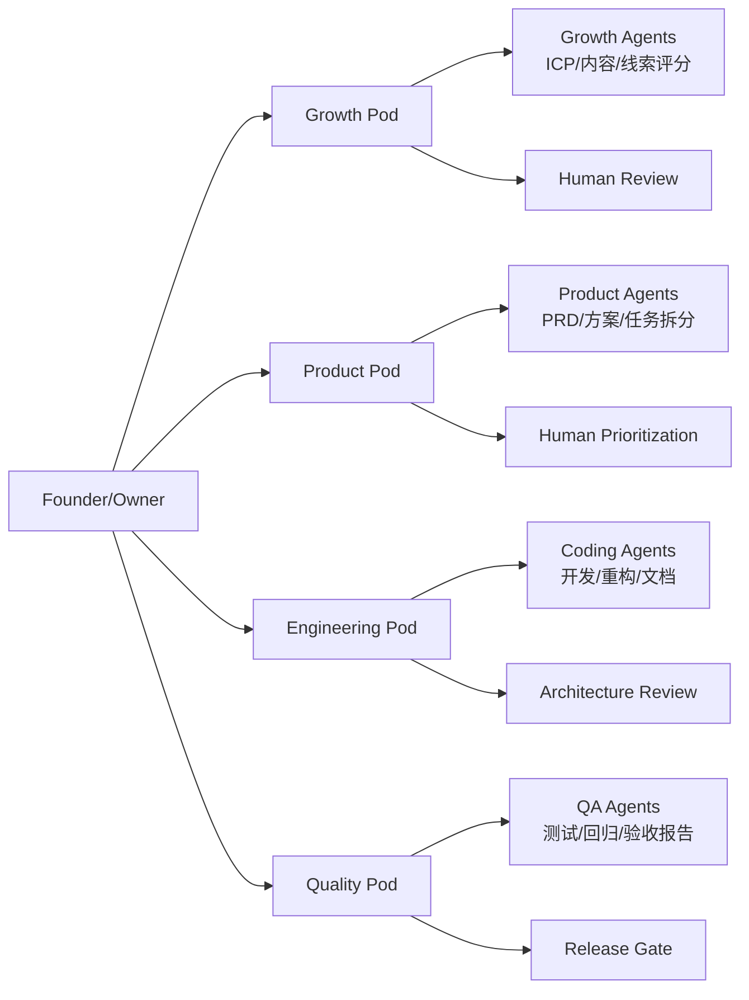
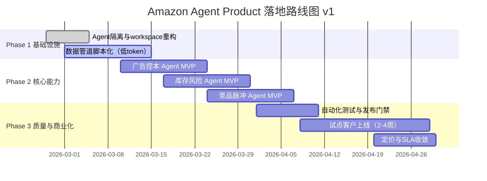

# 顶层架构设计 v1.1

> 在 v1 基础上新增：**计费模式设计**（Pricing + Metering + Guardrails）。

## 1. 设计目标
- 用 Agent 最大化替代人工的研究、设计、开发、测试流程
- 保持人类在高风险决策与发布门禁中的控制权
- 让用户通过 Agent 调用产品能力（而不是重后台操作）

## 2. OpenClaw 约束与原则
- 以 `agent + workspace + cron + subagent` 为主架构
- 程序化优先：采集、清洗、去重、评分先做成脚本
- LLM 聚焦高价值：解释、优先级、策略建议
- 高风险动作默认审批（广告预算、补货、定价）

## 3. 组织图（v1）


## 4. 系统架构图（v1）
```mermaid
flowchart TB
  U[Seller/User via Agent Chat]
  U --> CH[Channel Layer\nDiscord/Telegram/API]
  CH --> ORCH[OpenClaw Orchestration\nCron + Agent Turn + Subagents]

  ORCH --> CAP[Capability Layer]
  CAP --> C1[选品/趋势 Agent]
  CAP --> C2[广告控本 Agent]
  CAP --> C3[库存风险 Agent]
  CAP --> C4[竞品脉冲 Agent]

  CAP --> PIPE[Programmatic Pipeline\n采集->清洗->去重->聚类->评分]
  PIPE --> INTEL[LLM Intelligence\n解释/建议/优先级]

  INTEL --> OUT1[Obsidian Markdown]
  INTEL --> OUT2[Chat Summary]
  INTEL --> OUT3[Action Queue\n(Approve/Auto)]

  DATA[(Data Layer)]
  PIPE --> DATA
  INTEL --> DATA
```

## 5. 落地图（v1，90天）


## 6. 执行模式分级（风控）
- Observe：只看建议，不执行
- Approve：人工确认后执行（默认）
- Auto：仅低风险动作自动执行

## 7. 新增：计费模式设计（v1.1）

### 7.1 计费目标
- 与客户结果绑定（省时间/控成本/降风险）
- 计费简单可解释（不让卖家看不懂）
- 平台可控毛利（限制高成本调用）

### 7.2 三层定价（建议）

1) **Starter（新手卖家）**
- 月费：$199-$399
- 包含：日报、风险提醒、每周建议
- 限额：每月 N 次深度分析
- 适合：1-3 人团队、SKU 较少

2) **Growth（增长卖家）**
- 月费：$699-$1,299
- 包含：广告控本 + 库存风险 + 竞品脉冲
- 限额：更高分析频次 + 多站点支持
- 适合：4-15 人团队，持续投放

3) **Scale（多店/代运营）**
- 月费：$2,000+（可定制）
- 包含：多租户、审批流、SLA、优先支持
- 适合：多账号/多客户管理

### 7.3 计费模型（组合）
- **订阅费（主）**：按套餐收取基础能力
- **用量费（辅）**：超出限额按调用量/报告量计费
- **结果激励（可选）**：与 KPI 改善挂钩（如 ACOS 改善档位返利）

### 7.4 用量计量（Metering）
统一记录以下字段：
- tenant_id
- feature_id（skill场景）
- run_id / timestamp
- token_in / token_out（LLM耗用）
- pipeline_cost（程序层耗时/调用）
- result_quality（完整性/证据链接率）

### 7.5 成本控制策略
- 默认先跑程序化管道，后跑 LLM
- 长报告分层输出（摘要先行，详情按需）
- 失败重试上限 + 高成本动作冷却时间
- 对低价值重复请求做缓存

### 7.6 计费风控与争议处理
- 每次输出附带“证据链接 + 置信度 + 生成时间”
- 保留 30-90 天调用审计日志
- 争议工单可回放 run_id（可解释账单）

## 8. OpenClaw 适配修正（摘要）
- 当前阶段是局部最优：快落地、低摩擦、可迭代
- 未来迁移触发：高并发低延迟、多租户强隔离、监管级合规
- 战略：OpenClaw-first, decouple-ready

## 9. 下一步
- 产出《能力接口清单 v1》
- 产出《发布门禁规则 v1》
- 产出《计费账单字段字典 v1》
- 对接 ICP v1.2，优先验证 Primary ICP
