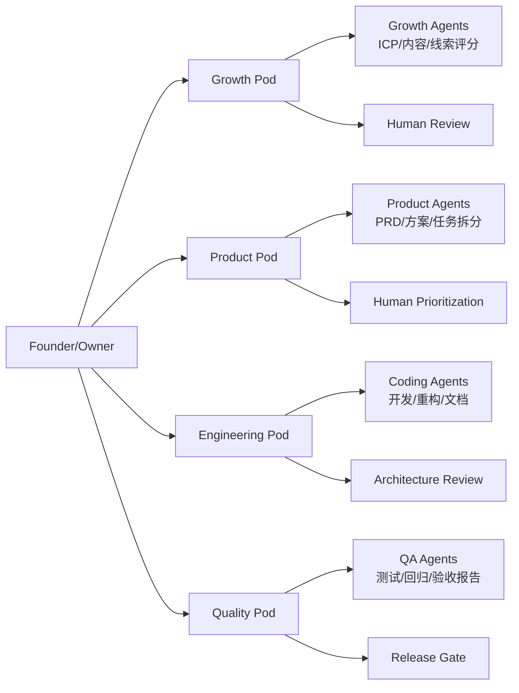
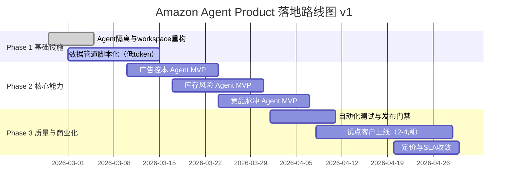

# 顶层架构设计 v1.2

> 在 v1.1 基础上新增：**评估指标体系（产品运营 + 数据分析）**，并将 **Token 使用量**纳入核心指标。

## 1. 设计目标
- 用 Agent 最大化替代人工的研究、设计、开发、测试流程
- 保持人类在高风险决策与发布门禁中的控制权
- 让用户通过 Agent 调用产品能力（而不是重后台操作）

## 2. OpenClaw 约束与原则
- 以 `agent + workspace + cron + subagent` 为主架构
- 程序化优先：采集、清洗、去重、评分先做成脚本
- LLM 聚焦高价值：解释、优先级、策略建议
- 高风险动作默认审批（广告预算、补货、定价）

## 3. 组织图（v1）


## 4. 系统架构图（v1）
```mermaid
flowchart TB
  U[Seller/User via Agent Chat]
  U --> CH[Channel Layer\nDiscord/Telegram/API]
  CH --> ORCH[OpenClaw Orchestration\nCron + Agent Turn + Subagents]

  ORCH --> CAP[Capability Layer]
  CAP --> C1[选品/趋势 Agent]
  CAP --> C2[广告控本 Agent]
  CAP --> C3[库存风险 Agent]
  CAP --> C4[竞品脉冲 Agent]

  CAP --> PIPE[Programmatic Pipeline\n采集->清洗->去重->聚类->评分]
  PIPE --> INTEL[LLM Intelligence\n解释/建议/优先级]

  INTEL --> OUT1[Obsidian Markdown]
  INTEL --> OUT2[Chat Summary]
  INTEL --> OUT3[Action Queue\n(Approve/Auto)]

  DATA[(Data Layer)]
  PIPE --> DATA
  INTEL --> DATA
```

## 5. 落地图（v1，90天）


## 6. 执行模式分级（风控）
- Observe：只看建议，不执行
- Approve：人工确认后执行（默认）
- Auto：仅低风险动作自动执行

## 7. 计费模式设计（承接 v1.1）

### 7.1 三层定价（建议）
- Starter：$199-$399/月（日报/提醒/周建议）
- Growth：$699-$1,299/月（广告+库存+竞品核心能力）
- Scale：$2,000+（多租户/SLA/审批流）

### 7.2 计费模型（组合）
- 订阅费（主）
- 用量费（辅）
- 结果激励（可选）

### 7.3 用量计量（Metering）
- tenant_id, feature_id, run_id, timestamp
- token_in, token_out
- pipeline_cost
- result_quality

## 8. 新增：评估指标体系（产品运营 + 数据分析）

### 8.1 指标分层

#### A. 业务结果指标（卖家价值）
- ACOS 变化率（周/月）
- ROAS 变化率
- 断货 SKU 数变化
- 每周人工运营时长节省（小时）
- 建议采纳后 ROI（可估算）

#### B. 产品运营指标（产品健康）
- DAU/WAU（活跃租户数）
- 功能使用渗透率（各 skill 调用占比）
- 建议采纳率（adoption rate）
- 留存率（7/30/90 天）
- 试点转付费率

#### C. 系统与质量指标（稳定性）
- 任务成功率（cron success rate）
- 平均执行时长（P50/P95）
- 报告完整率（带证据链接的事件占比）
- 错误率（接口/抓取/解析）
- 回滚触发次数

#### D. 成本指标（必须纳入 Token）
- **Token 总量（token_in + token_out）/日/租户/功能**
- **单次任务 Token 成本（$/run）**
- **单租户月 Token 成本（$/tenant/month）**
- 程序化流程占比（越高越省）
- “每 1 美元成本带来的业务改善”指标（成本效率）

### 8.2 指标口径定义（v1）
- Token 使用量：按 run_id 聚合，拆分输入/输出
- 采纳率：被用户执行的建议数 / 总建议数
- 报告完整率：含时间+来源链接+评分字段的事件数 / 总事件数
- 任务成功率：状态为 ok 的任务数 / 总触发任务数

### 8.3 指标阈值（初始建议）
- 任务成功率 >= 95%
- 报告完整率 >= 98%
- 建议采纳率 >= 30%（试点期）
- 单租户月 Token 成本占月费 <= 25%

### 8.4 运营看板建议（每周）
- 看板1：业务价值（ACOS/ROAS/断货/时间节省）
- 看板2：产品增长（活跃/留存/采纳/转付费）
- 看板3：成本效率（Token/运行成本/单位收益）

## 9. OpenClaw 适配修正（摘要）
- 当前阶段是局部最优：快落地、低摩擦、可迭代
- 未来迁移触发：高并发低延迟、多租户强隔离、监管级合规
- 战略：OpenClaw-first, decouple-ready

## 10. 下一步
- 产出《能力接口清单 v1》
- 产出《发布门禁规则 v1》
- 产出《指标口径字典 v1》（含 token 字段定义）
- 对接 ICP v1.2，优先验证 Primary ICP
